<a href="https://github.com/z1-0/ah.sh"><picture><source media="(prefers-color-scheme: dark)" srcset="./assets/ah.sh-dark.svg"><source media="(prefers-color-scheme: light)" srcset="./assets/ah.sh-light.svg"></picture></a> &nbsp;&nbsp;<a href="https://github.com/z1-0/skills-nix"><picture><source media="(prefers-color-scheme: dark)" srcset="./assets/skills-nix-dark.svg"><source media="(prefers-color-scheme: light)" srcset="./assets/skills-nix-light.svg"></picture></a>

<a href="https://github.com/z1-0/nix-ast"><picture><source media="(prefers-color-scheme: dark)" srcset="./assets/nix-ast-dark.svg"><source media="(prefers-color-scheme: light)" srcset="./assets/nix-ast-light.svg"></picture></a> &nbsp;&nbsp;<a href="https://github.com/z1-0/nix-meta"><picture><source media="(prefers-color-scheme: dark)" srcset="./assets/nix-meta-dark.svg"><source media="(prefers-color-scheme: light)" srcset="./assets/nix-meta-light.svg"></picture></a>

<a href="https://github.com/z1-0/srctree-nix"><picture><source media="(prefers-color-scheme: dark)" srcset="./assets/srctree-nix-dark.svg"><source media="(prefers-color-scheme: light)" srcset="./assets/srctree-nix-light.svg"></picture></a> &nbsp;&nbsp;<a href="https://github.com/z1-0/metatree-nix"><picture><source media="(prefers-color-scheme: dark)" srcset="./assets/metatree-nix-dark.svg"><source media="(prefers-color-scheme: light)" srcset="./assets/metatree-nix-light.svg"></picture></a>

<a href="https://github.com/z1-0/nix-bulkfetch-url"><picture><source media="(prefers-color-scheme: dark)" srcset="./assets/nix-bulkfetch-url-dark.svg"><source media="(prefers-color-scheme: light)" srcset="./assets/nix-bulkfetch-url-light.svg"></picture></a> &nbsp;&nbsp;<a href="https://github.com/z1-0/nixos-config"><picture><source media="(prefers-color-scheme: dark)" srcset="./assets/nixos-config-dark.svg"><source media="(prefers-color-scheme: light)" srcset="./assets/nixos-config-light.svg"></picture></a>

